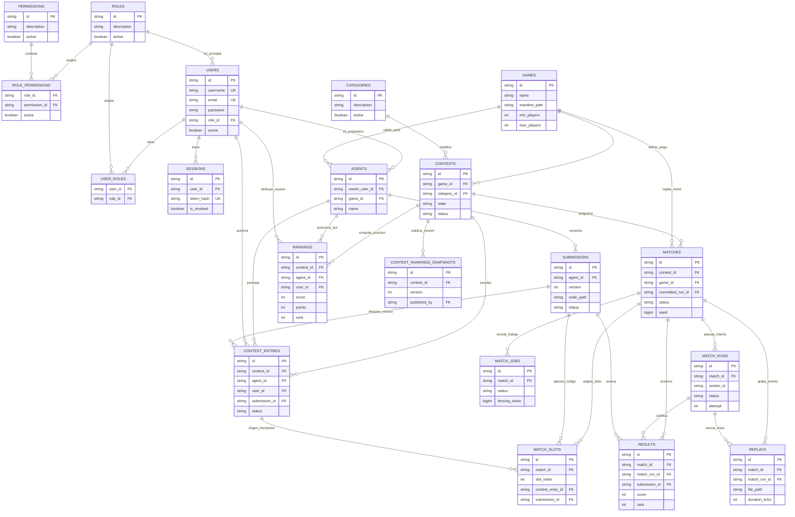

# Agentrix

Agentrix es una plataforma universitaria para concursos de agentes. El repositorio contiene un MVP experimental de extremo a extremo para **Starfighter**, el único juego admitido actualmente: una API y un worker en Go coordinan bots Python persistentes y un motor autoritativo headless en Rust; la web React reproduce snapshots públicos guardados como NDJSON.

El proyecto **no está certificado para producción**. La simulación y el visor existen, pero el aislamiento de bots, la recuperación de trabajos, el sellado de resultados y el despliegue todavía tienen brechas documentadas.

## Estado actual

| Componente | Estado | Evidencia principal |
| --- | --- | --- |
| API REST y worker Go | Parcial | Se construyen en un único binario y proceso; todavía no se despliegan por separado. |
| Motor Starfighter | Implementado | `agentrix_engine` usa Bevy y Avian2D y expone `agentrix-engine/1` por JSON Lines. |
| Bots Python | Parcial | El proceso persiste durante la partida y usa tick 0, pero el sandbox no es apto para producción. |
| PostgreSQL | Parcial | Guarda datos estructurados y trabajos; la reserva carece de heartbeat y fencing. |
| Replay | Parcial | NDJSON progresivo con snapshots públicos y hashes; faltan sello inmutable y metadatos completos de reproducción. |
| Web | Implementado para el corte público | React, tema claro y visor Canvas 2D posterior a la partida. No hay directo por WebSocket. |
| Multi-juego, Gym y sim-core | No implementado | Son etapas posteriores al cierre del MVP seguro. |

## Componentes

```text
web React ──HTTP──> API Go ──> PostgreSQL / artifacts
                         │
                         └── worker Go
                               ├── bots Python persistentes
                               ├── agentrix-engine/1
                               └── motor Rust Starfighter
```

Go conserva las acciones y percepciones específicas del juego como JSON opaco. Rust valida esas acciones, ejecuta las reglas, produce percepciones privadas y emite el snapshot público y el resultado autoritativos.

## Modelo relacional de base de datos

El esquema relacional en PostgreSQL modela el ciclo de vida completo de la plataforma: control de accesos (RBAC), torneos, bots y versiones, cola de orquestación autoritativa, resultados y clasificaciones deterministas:



Los scripts modulares de definición se encuentran organizados en [`db/database/`](db/database/) y las semillas canónicas en [`db/data/`](db/data/).

## Requisitos de desarrollo

- Go según `go.mod` (actualmente 1.25).
- Rust estable según `agentrix_engine/rust-toolchain.toml`.
- Python 3 para los bots.
- Node.js y npm compatibles con `web/package-lock.json`.
- PostgreSQL para persistencia y cola autoritativas.
- Repositorio hermano `agentrix_engine` para construir el motor.

## Comandos comprobados

```bash
GOCACHE=/tmp/agentrix-go-cache go build -mod=readonly ./...
GOCACHE=/tmp/agentrix-go-cache go vet -mod=readonly ./...
cd web && npm test -- --run && npm run build
cd ../../agentrix_engine && cargo test --locked
```

`go test -mod=readonly ./...` es el comando correcto para la suite Go, pero al 2026-09-19 falla en `src/executor` cuando Bubblewrap es detectable y los procesos de prueba no consiguen iniciar dentro del entorno restringido. No debe presentarse como una validación verde hasta resolver y volver a ejecutar esos casos.

Para construir el motor y el binario Go:

```bash
make build-engine
make build
```

## Arranque rápido y verificación de demo (Fase 7 / Fase 9)

El stack completo de Agentrix incluye plano de control en Go, base de datos PostgreSQL con migraciones versionadas (Goose v4), motor de simulación Starfighter en Rust, bots de ejemplo en Python y frontend web en React + Vite.

1. **Levantar el stack completo:**
   ```bash
   make demo-up
   # o alternativamente: docker compose up --build -d
   ```
2. **Inicializar y poblar con datos y ejecuciones auténticas:**
   ```bash
   make demo-reset
   # ejecuta migraciones automáticas y cmd/bootstrap con simulación real del motor
   ```
3. **Ejecutar verificación de humo integral (13 pasos):**
   ```bash
   make demo-smoke
   # verifica: liveness, readiness, login admin/pilot, RBAC (403), submissions,
   # slots, simulación con motor y bots reales, timeout, resultados, replay zstd y ranking
   ```
4. **Detener el stack:**
   ```bash
   make demo-down
   ```

`make build` ejecuta formateo con escritura, pruebas y compilación. Revise primero el worktree. Los targets de base de datos modifican PostgreSQL y no deben ejecutarse como comprobación rutinaria.

## Documentación

La fuente de navegación es [docs/index.md](docs/index.md). El alcance real del MVP está en [docs/product/mvp-scope.md](docs/product/mvp-scope.md) y la única hoja de ruta vigente en [docs/roadmap/current.md](docs/roadmap/current.md).

Los documentos bajo `docs/archive/` son históricos y no dirigen desarrollo nuevo.
