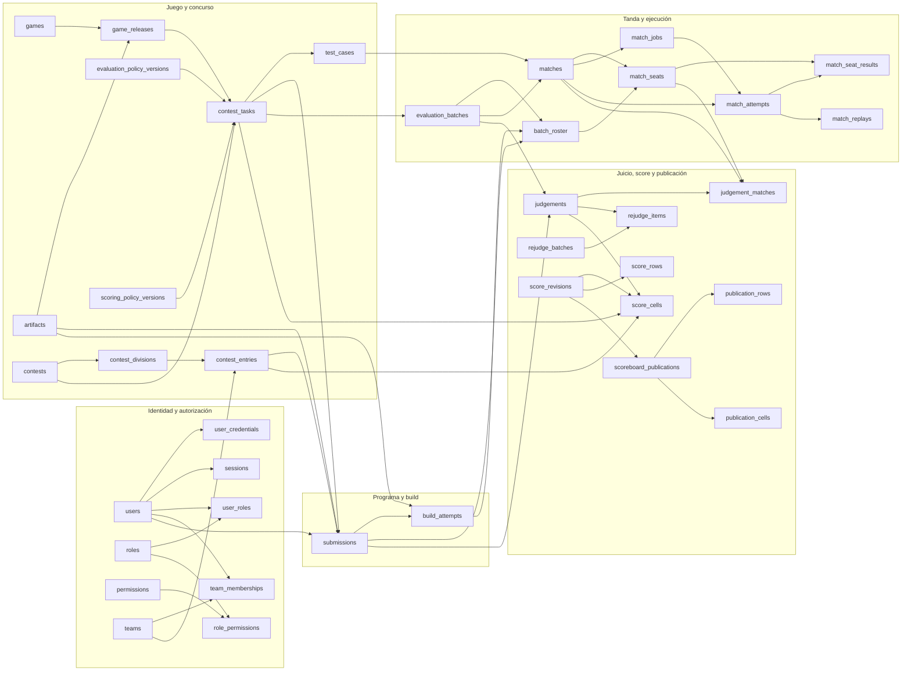
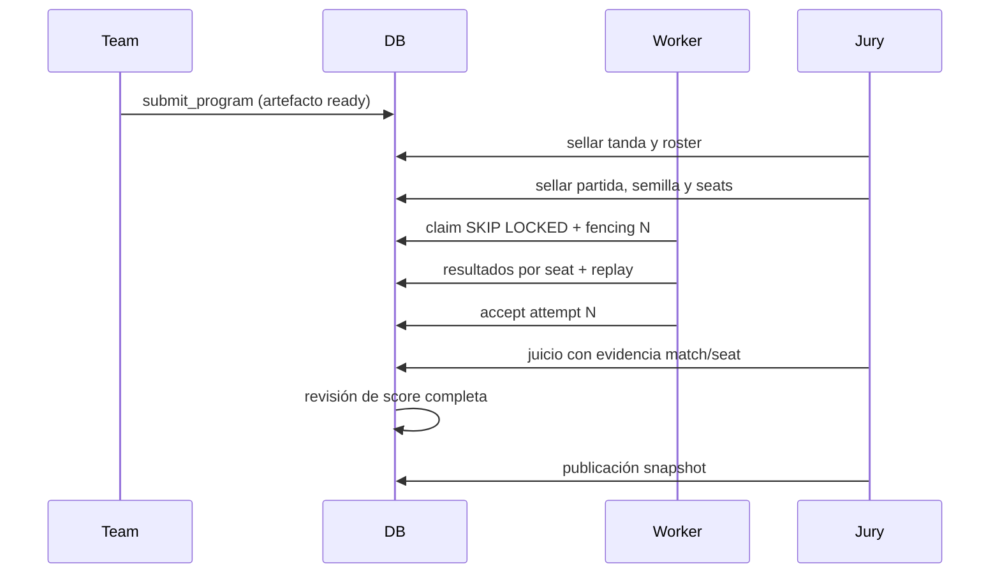

# Diagrama ER por módulos

El diagrama omite columnas de auditoría y tablas puente menores para mostrar las
autoridades principales. Las flechas representan FKs, no flujo de ejecución.

Cadena temporal reproducible:

