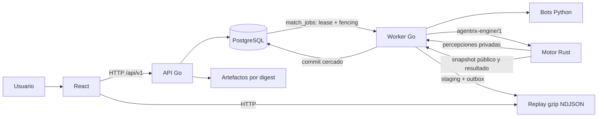

# Arquitectura de Agentrix

## Estado actual

Agentrix está distribuido en dos repositorios:

- `Agentrix`: API, worker, persistencia, artefactos, contratos y web.
- `agentrix_engine`: motor autoritativo headless de Starfighter.



**Implementado:** API (`cmd/api`) y worker (`cmd/worker`) son binarios y contenedores separados. PostgreSQL es obligatorio: no hay cola en memoria. Los artefactos se guardan en filesystem con claves direccionadas por contenido (`submissions/sha256/<hex>.py`, replays por run) y escritura atómica. La API nunca ejecuta bots.

## Responsabilidades vigentes

| Componente | Responsabilidad | No debe hacer |
| --- | --- | --- |
| API Go | HTTP, autenticación, casos de uso y consulta pública | Ejecutar reglas del juego |
| Worker Go | Reservar trabajos, supervisar bots y motor, transportar mensajes | Interpretar acciones Starfighter |
| Motor Rust | Simulación, percepciones, reglas, hashes y resultado | Ejecutar bots, consultar DB o escribir replay |
| PostgreSQL | Datos estructurados y cola autoritativa | Guardar artefactos grandes como diseño objetivo |
| Artifact store | ZIP, bots y replay | Decidir estados competitivos |
| Web React | Interacción y reproducción pública | Recalcular físicas o resultados |

## Organización interna de Go

La decisión vigente mantiene un recorrido horizontal y reconocible:

```text
open-api/openapi.yaml            (un solo archivo, x-agentrix-policy por operación)
  -> src/server/handlers_*.go    (tabla de rutas con Policy; authorize falla cerrado)
  -> src/service/<feature>.go    (casos de uso, capacidades, transiciones)
  -> src/repository/<feature>.go (SQL; clasifica errores de Postgres en errores de dominio)
  -> src/model/                  (entidades, máquinas de estado, ExecutionSpec, ranking)
```

`repository` se conserva porque contiene SQL y permite que `service` proteja reglas sin conocer persistencia. `openapi_contract_test.go` falla si una ruta, política o campo de DTO diverge del contrato.

## Objetivo aprobado y estado

- API y worker desplegables por separado. **Implementado.**
- PostgreSQL obligatorio. **Implementado:** esquema canónico `00001_canonical.sql`; la API y el worker verifican la versión y los objetos críticos al arrancar.
- Runtime de bots rootless y fail-closed. **Implementado:** Bubblewrap o Podman; `direct` solo en `dev`.
- Leases renovables, fencing e idempotencia. **Implementado:** heartbeat, reaper, token desde una secuencia, `Idempotency-Key`.
- Artefactos y replays inmutables identificados por digest. **Implementado.**
- Contratos versionados en toda frontera de proceso: `agentrix-execution-spec/1`, `agentrix-engine/1`, `agentrix-replay/2`, OpenAPI.
- Starfighter sigue siendo el único juego hasta cerrar y certificar el MVP.

La ruta hacia más juegos está descrita en [game-extension.md](game-extension.md), no en el bucle actual del executor.
