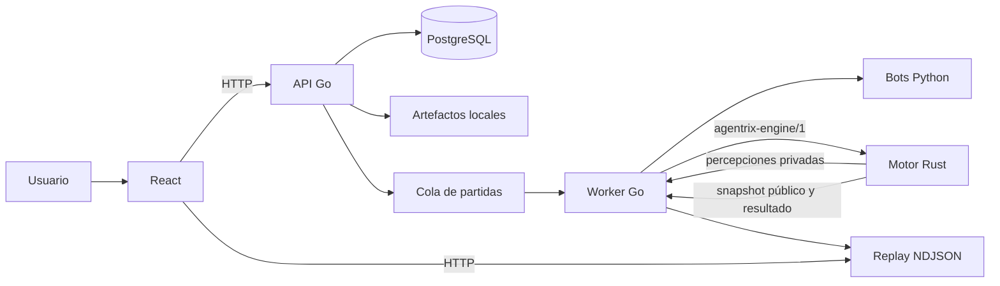

# Arquitectura de Agentrix

## Estado actual

Agentrix está distribuido en dos repositorios:

- `Agentrix`: API, worker, persistencia, artefactos, contratos y web.
- `agentrix_engine`: motor autoritativo headless de Starfighter.



**Parcial:** API y worker tienen fronteras de código, pero `main.go` los inicia dentro del mismo proceso. Los artefactos usan filesystem local. PostgreSQL es autoritativo cuando existe; en ausencia de conexión el proceso cae a una cola en memoria incluso sin una política explícita de entorno.

## Responsabilidades vigentes

| Componente | Responsabilidad | No debe hacer |
| --- | --- | --- |
| API Go | HTTP, autenticación, casos de uso y consulta pública | Ejecutar reglas del juego |
| Worker Go | Reservar trabajos, supervisar bots y motor, transportar mensajes | Interpretar acciones Starfighter |
| Motor Rust | Simulación, percepciones, reglas, hashes y resultado | Ejecutar bots, consultar DB o escribir replay |
| PostgreSQL | Datos estructurados y cola autoritativa | Guardar artefactos grandes como diseño objetivo |
| Artifact store | ZIP, bots y replay | Decidir estados competitivos |
| Web React | Interacción y reproducción pública | Recalcular físicas o resultados |

## Organización interna de Go

La decisión vigente mantiene un recorrido horizontal y reconocible:

```text
open-api/contests.yaml
  -> src/server/contests.go
  -> src/service/contests.go
  -> src/repository/contests.go
  -> src/model/contest.go
```

`repository` se conserva porque contiene SQL y permite que `service` proteja reglas sin conocer persistencia. La interfaz global actual es deuda: debe reducirse mediante interfaces pequeñas definidas por el consumidor cuando un corte real lo requiera.

## Objetivo aprobado

- API y worker seleccionables y desplegables por separado.
- PostgreSQL obligatorio fuera de desarrollo.
- Runtime de bots rootless y fail-closed.
- Leases renovables, fencing e idempotencia para trabajos y resultados.
- Artefactos y replays inmutables identificados por digest.
- Contratos versionados en toda frontera de proceso.
- Starfighter sigue siendo el único juego hasta cerrar y certificar el MVP.

La ruta hacia más juegos está descrita en [game-extension.md](game-extension.md), no en el bucle actual del executor.
