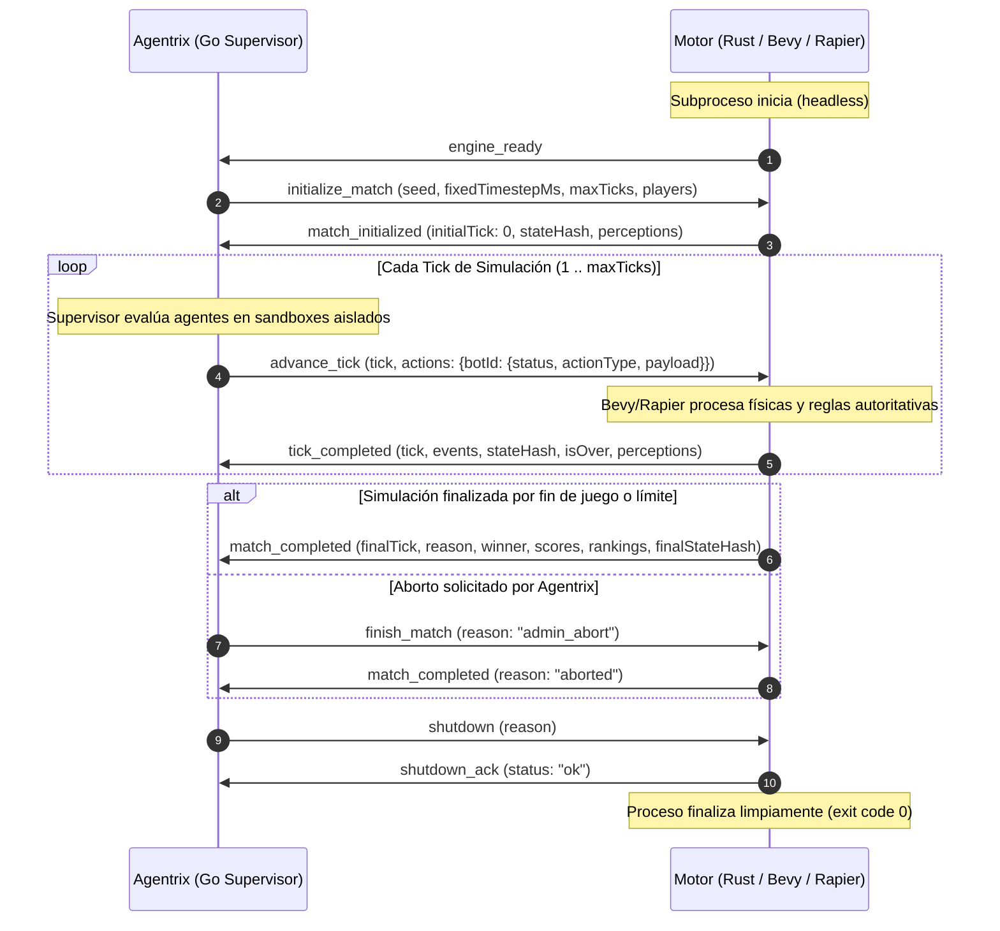

# Contrato de Integración Agentrix — Motor de Simulación (v1)

- **Versión del protocolo:** `agentrix-engine/1`
- **Público objetivo:** Desarrolladores del motor oficial (Rust / Bevy / Rapier).
- **Modo de ejecución:** *Headless* (sin ventana, sin renderizado gráfico en el motor).

Este documento especifica la interfaz de comunicación que debe implementar el motor de juego para integrarse con Agentrix sin acoplamiento a detalles internos de Go ni a la base de datos de la plataforma.

---

## 1. Transporte y Convenciones de E/S

La comunicación se establece a través de los descriptores estándar del subproceso:

| Descriptor | Dirección | Uso exclusivo |
| :--- | :--- | :--- |
| `stdin` | Agentrix $\rightarrow$ Motor | Comandos de control e información de ticks en formato JSON Lines. |
| `stdout` | Motor $\rightarrow$ Agentrix | **Exclusivamente** mensajes del protocolo `agentrix-engine/1` en JSON Lines. **Prohibido emitir texto libre o logs por stdout.** |
| `stderr` | Motor $\rightarrow$ Agentrix | Logs operativos, diagnósticos de Bevy/Rapier y mensajes de depuración. Agentrix capturará y acotará estos logs. |

### Reglas de Formato
1. **JSON Lines (JSONL):** Cada mensaje es un objeto JSON codificado en UTF-8 serializado en **una sola línea** terminada en `\n` (`0x0A`).
2. **Sin JSON multilínea:** No se admiten saltos de línea dentro de un mensaje.
3. **Límites de tamaño:** La longitud máxima por línea soportada por defecto es de **1 MB (1,048,576 bytes)**. Mensajes que excedan este tamaño serán truncados y provocarán un error de violación de protocolo.

---

## 2. Estructura del Sobre (`Envelope`)

Todo mensaje (en ambas direcciones) debe estar contenido en el sobre canónico definido en [`envelope.schema.json`](./envelope.schema.json):

```json
{
  "protocolVersion": "agentrix-engine/1",
  "type": "tick_completed",
  "matchId": "m-12345678-abcd",
  "sequence": 42,
  "payload": {}
}
```

### Campos del Sobre
- `protocolVersion` (*string*, obligatorio): Debe ser exactamente `"agentrix-engine/1"`. Si el motor recibe otra versión o Agentrix recibe otra versión, se produce un error fatal.
- `type` (*string*, obligatorio): Uno de los tipos reconocidos por el protocolo.
- `matchId` (*string*, obligatorio): Identificador de la partida. Cadena vacía `""` permitida únicamente antes de inicializar la partida (`engine_ready`, `shutdown`).
- `sequence` (*integer*, obligatorio, $\ge 1$): Contador monotónico incremental independiente por emisor que inicia en `1`.
- `payload` (*object*, obligatorio): Estructura de datos correspondiente al `type`.

---

## 3. Ciclo de Vida y Flujo de Mensajes



---

## 4. Tipos de Mensajes

### A. De Agentrix hacia el Motor (`stdin`)

1. **`initialize_match`** ([Esquema](./initialize-match.schema.json)):
   - Configura las condiciones de la partida: `matchId`, `gameId`, `seed`, `fixedTimestepMs`, `maxTicks`, `players` (array de IDs) y `config` opcional.
2. **`advance_tick`** ([Esquema](./advance-tick.schema.json)):
   - Indica el `tick` correlativo a ejecutar y entrega las acciones recolectadas.
   - Cada participante tiene un `status`:
     - `"valid"`: El bot envió una acción semántica (`actionType` y `payload`).
     - `"timeout"`: El bot agotó su presupuesto de tiempo por tick.
     - `"invalid_output"`: El bot respondió datos corruptos o no conformes a su contrato.
     - `"crashed"`: El subproceso del bot finalizó abruptamente.
     - `"disqualified"`: El bot fue descalificado por el supervisor.
   - **Importante:** Agentrix nunca sustituye silenciosamente un fallo por una acción neutra como `REST`; el motor recibe el estado del agente y aplica las reglas físicas/competitivas correspondientes.
3. **`finish_match`** ([Esquema](./finish-match.schema.json)):
   - Solicita la detención inmediata de la partida antes de alcanzar el límite de ticks.
4. **`shutdown`** ([Esquema](./shutdown.schema.json)):
   - Ordena el cierre ordenado del subproceso del motor.

### B. Del Motor hacia Agentrix (`stdout`)

1. **`engine_ready`** ([Esquema](./engine-ready.schema.json)):
   - Emitido inmediatamente al arrancar. Declara `engineVersion`, `supportedProtocols: ["agentrix-engine/1"]` y `capabilities`.
2. **`match_initialized`** ([Esquema](./match-initialized.schema.json)):
   - Confirma la creación del mundo, estado inicial `tick: 0`, hash criptográfico inicial y el primer lote de percepciones privadas para cada slot.
3. **`tick_completed`** ([Esquema](./tick-completed.schema.json)):
   - Resultado del tick: `tick`, `events` (strings públicos de eventos), `stateHash` (digest acumulativo), `isOver` (booleano), `winner` (opcional), `publicState` (opcional para el visor) y `perceptions` (percepción privada filtrada para el siguiente tick para cada bot activo).
4. **`match_completed`** ([Esquema](./match-completed.schema.json)):
   - Cierre de la partida: `finalTick`, `reason` (`"time_limit"`, `"victory"`, `"elimination"`, `"draw"`, `"aborted"`), `scores` (mapa de puntajes numéricos), `rankings` (array ordenado de puestos) y `finalStateHash`.
5. **`engine_error`** ([Esquema](./engine-error.schema.json)):
   - Reporte de fallo del motor: `code` estructurado, `message` humano redactado y `fatal` (si true, aborta el proceso).
6. **`shutdown_ack`** ([Esquema](./shutdown-ack.schema.json)):
   - Acuse de recibo antes de terminar con código de salida `0`.

---

## 5. Garantía de Determinismo y Reproducibilidad

Bajo la misma versión del binario del motor, misma arquitectura de CPU, misma semilla (`seed`), misma configuración de timestep y la misma secuencia de acciones en `advance_tick`, el motor **debe generar exactamente la misma secuencia de eventos, los mismos puntajes y los mismos `stateHash`**.

No se permite el uso de generadores aleatorios no anclados a la semilla provista ni lecturas del reloj del sistema para la toma de decisiones físicas dentro del bucle de simulación.

---

## 6. Esquemas JSON y Ejemplos

Los esquemas autoritativos se encuentran en esta misma carpeta:
- `envelope.schema.json`
- `initialize-match.schema.json`
- `advance-tick.schema.json`
- `engine-ready.schema.json`
- `match-initialized.schema.json`
- `tick-completed.schema.json`
- `match-completed.schema.json`
- `engine-error.schema.json`
- `finish-match.schema.json`
- `shutdown.schema.json`
- `shutdown-ack.schema.json`

Consulte `examples/valid/` y `examples/invalid/` para referencias prácticas de implementación.
